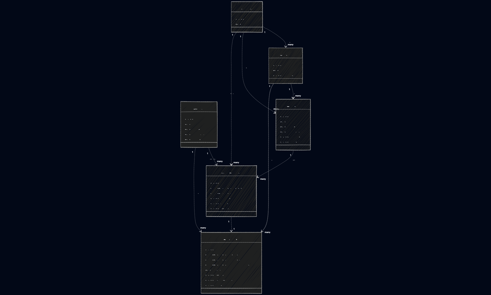

# 📌 Protocolo: Equatorial

**Sistema de Gestão e Acompanhamento de Atendimentos de Campo**

---

## 📖 Apresentação

O **Protocolo: Equatorial** é uma aplicação desktop desenvolvida como **trabalho final da disciplina de Programação Orientada a Objetos (POO)** do **Instituto Federal do Piauí (IFPI) - 2026.2**.

O sistema tem como objetivo simular o **acompanhamento de atendimentos e equipes de campo** de uma empresa fornecedora de energia, permitindo o controle de **clientes**, **agendamentos**, **protocolos**, **técnicos**, **equipes** e **agências**, além do acompanhamento das datas previstas de atendimento.

⚠️ **Observação importante:**
Este projeto é **exclusivamente um estudo de caso acadêmico** e **não representa** nem reflete os sistemas, dados ou fluxos reais da empresa Equatorial Energia.

Dupla:

- Giovanna Alves de Oliveira
- Maria Helena Gomes da Silva

---

## 🎯 Objetivos do Projeto

O projeto foi desenvolvido com foco em:

* Aplicar de forma prática os **quatro pilares da Programação Orientada a Objetos**
* Desenvolver uma aplicação completa com **arquitetura em camadas**
* Implementar **persistência de dados relacional** utilizando **JDBC puro**
* Utilizar **Design Patterns** adequados ao contexto da aplicação
* Garantir **código limpo, organizado e manutenível**

---

## 🧱 Arquitetura do Sistema

A aplicação foi desenvolvida em **Java**, utilizando **Maven** como gerenciador de dependências e **SQLite** como banco de dados relacional embarcado, garantindo **portabilidade** e **facilidade de execução**.

### 🧩 Padrão Arquitetural

O projeto segue o padrão **MVC (Model–View–Controller)**, promovendo a separação clara de responsabilidades:

* **Model**
  Contém as entidades do domínio e regras de negócio.

* **View**
  Responsável pela interface gráfica e interação com o usuário.

* **Controller**
  Atua como intermediário entre a View e o Model, coordenando as ações do sistema.

---

## 📂 Organização dos Pacotes

```text
src/main/java
 ├── model        → Entidades e classes de domínio
 ├── dao          → Acesso a dados (JDBC + SQL)
 ├── controller   → Regras de aplicação e orquestração
 ├── view         → Interfaces gráficas (Swing/JavaFX)
 ├── service      → Regras de negócio
 ├── exception    → Exceções customizadas do domínio
 └── util         → Utilitários (ConnectionFactory, DatabaseInitializer, etc.)

src/main/resources
 ├── schema.sql   → Criação das tabelas do banco
 └── seed.sql     → Dados iniciais para testes
```

---

## 🧠 Programação Orientada a Objetos

O projeto aplica de forma consciente os **quatro pilares da POO**:

* **Encapsulamento**
  Atributos privados com acesso controlado por métodos.

* **Abstração**
  Uso de classes abstratas e interfaces para definir contratos.

* **Herança**
  Reutilização de comportamento entre classes relacionadas.

* **Polimorfismo**
  Implementação de interfaces e sobrescrita de métodos para especialização de comportamentos.

---

## ✨ Clean Code e SOLID

O código foi desenvolvido seguindo princípios de **Clean Code** e **SOLID**, visando clareza, manutenibilidade e baixo acoplamento.

### Princípios aplicados:

* **S — Single Responsibility Principle**
  Cada classe possui uma única responsabilidade bem definida.

* **O — Open/Closed Principle**
  Classes abertas para extensão e fechadas para modificação.

* **L — Liskov Substitution Principle**
  Substituição segura entre abstrações e implementações.

* **I — Interface Segregation Principle**
  Interfaces específicas e coesas.

* **D — Dependency Inversion Principle**
  Dependência de abstrações, não de implementações concretas.

📌 Exemplo prático:

* Interfaces para serviços e DAOs
* Implementações desacopladas
* Exceções de domínio customizadas (`BusinessException`)

---

## 🧩 Design Patterns Utilizados

O projeto aplica padrões de projeto clássicos para melhorar a qualidade do código:

### 🔹 Singleton

Utilizado no gerenciamento da conexão com o banco de dados, garantindo uma única instância ativa.

### 🔹 Factory

Responsável pela criação de objetos complexos, como DAOs e conexões JDBC.

### 🔹 DAO (Data Access Object)

Isola completamente o acesso ao banco de dados, mantendo SQL fora das camadas de controle e visão.

### 🔹 MVC

Estrutura principal do sistema, separando dados, regras e interface gráfica.

---

## 💾 Persistência de Dados

* **Tecnologia:** JDBC puro (sem ORM)
* **Banco de dados:** SQLite (embarcado)
* **Inicialização automática:**
  O banco de dados é criado automaticamente a partir do arquivo `schema.sql`.
* **Carga de dados para testes:**
  O arquivo `seed.sql` pode ser utilizado para popular o banco com dados iniciais.

---

## ▶️ Execução do Projeto

### Requisitos:

* Java JDK 17 ou superior
* Maven

### Passos:

```bash
mvn clean package
java -jar target/protocolo-equatorial.jar
```

---

## 📊 Diagramas

O projeto inclui **Diagrama de Classes UML**, representando as entidades, relacionamentos e abstrações do sistema.

> 💡 O diagrama foi gerado com **Mermaid**, garantindo clareza e padronização visual.



---

## 🎓 Considerações Finais

Este projeto consolida os principais conceitos abordados na disciplina de Programação Orientada a Objetos, simulando um cenário real de desenvolvimento de software, com foco em **arquitetura**, **boas práticas**, **design orientado a objetos** e **persistência de dados**.
